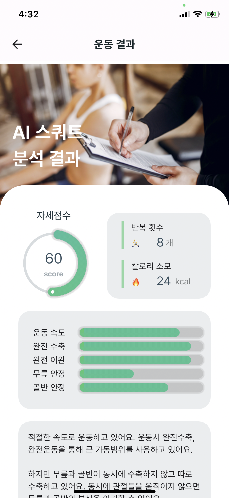

# Exercise Posture Analysis & Feedback Application for Flutter

## Description

This project suggest <strong>"exercise posture analysis algorithm"</strong> for Flutter.

ML kit pose detection plugin is used to get the coordinates of human joints. our algorithm calculate angles between these joints. than <strong>count the number of exercises and analyze whether users' exercise posture is correct.</strong>

## UI 

## Previous Project
this project is upgraded version of
[AI_APP_MyPT_StrongFriends](https://github.com/osamhack2021/AI_APP_MyPT_StrongFriends).
